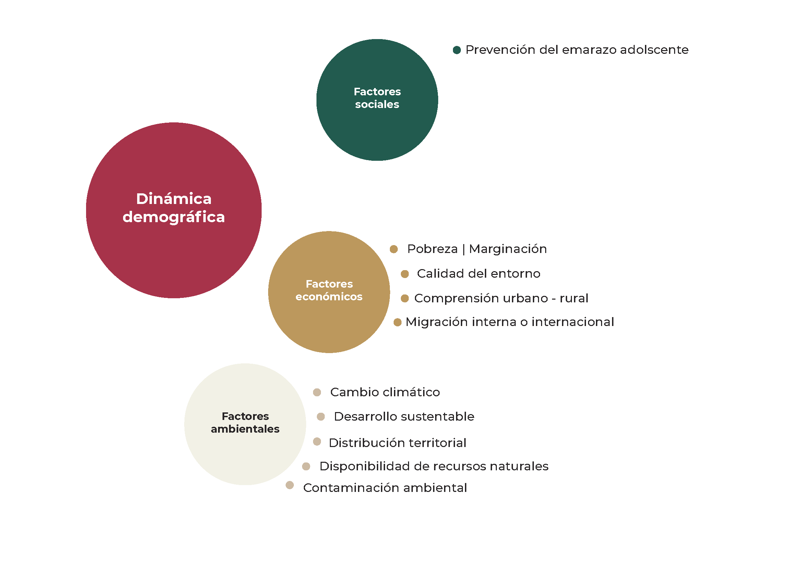

```{r setup, include=FALSE, echo = FALSE}
#options(htmltools.dir.version = FALSE)
knitr::opts_chunk$set(
                      fig.width=9, 
                      fig.height=3.5, 
                      fig.retina=3,
                      out.width = "100%",
                      cache = FALSE,
                      echo = TRUE,
                      message = FALSE, 
                      warning = FALSE,
                      error = FALSE,
                      hiline = TRUE,
                      dpli = 300
                    )

library(xaringanthemer)
style_duo_accent(
  primary_color = "#D56A2E",
  secondary_color = "#FF961C",
  inverse_header_color = "#FFFFFF"
)


require(knitr)
require(tidyverse)
#require(icons)
require(fontawesome)
require(xaringanExtra)

#xaringanExtra::use_tile_view()
#xaringanExtra::use_panelset()
#xaringanExtra::style_share_again(
 # share_buttons = c("twitter", "linkedin", "pocket")
#

# Correr las presentaciones 
#xaringan::inf_mr()
#xaringan::infinite_moon_reader()
```


class: inverse, center, middle, titular, bg-black, title-down
background-image: url(img/fondo_conapo.png)
background-size: contain
background-position: -66% 10%

<!-- Presentación inicial  -->

# Consejo Nacional de Población  


---
class: middle, title-down


<!-- Areás de un actuario  -->

.pull-left[
# Áreas profesionales
]

.pull-right[.center[
      ]
]

---
class: center, title-down


---
class: center, title-down


<!-- CONAPO | INEGI  -->

## ¿¿A qué se dedicada cada uno?? 

.pull-left[.center[
      ]
]

.pull-right[.center[
        ]
]

---
class: center


<!-- INEGI (Temas) -->


---
class: center, 


<!-- Dinámica poblacional -->

## CONAPO

<!-- Imagen inicial -->


--
<!-- Imagen sobrepuesta -->


---
class: middle, center 


<!-- Dinámica demográfica -->

## CONAPO



---
class: middle, title-down, logo-slide


<!-- Lenguajes de programación  -->

.pull-left[
# Lenguajes de programación 📦
]

.pull-right[
  .center[
  ]
]

---

class: center


<!-- Mapa Leaflet  -->

### Pueden crear mapas dinámicos 📦

<!--html_preserve-->
<iframe src = "https://dvillasanao.github.io/IME_Leaflet/IME_2020.html" position= "absolute"; top="0"; left="0"; bottom="0"; right="0"; width="100%"; height="70%"; border="none"; margin="0"; padding="0";  frameborder="0"; overflow="hidden"; display= "block";  min-height= "60vh";>"</iframe>
<!--/html_preserve-->

---
class: center, middle
background-image: url(img/Anahuac_fondo.png)
background-size: contain
background-position: 0% 10%

<!-- Pregunta. Cuándo no tenemos datos?  -->

.left-column[]
.right-column[.center[<span class="large-text">¿Cuándo no tenemos datos?</span>
    ]
  ]

---
class: center, middle

<!-- GiF  -->

<iframe src="https://giphy.com/embed/WRQBXSCnEFJIuxktnw" width="500" height="300"  style="" frameBorder="0" class="giphy-embed"></iframe>

---