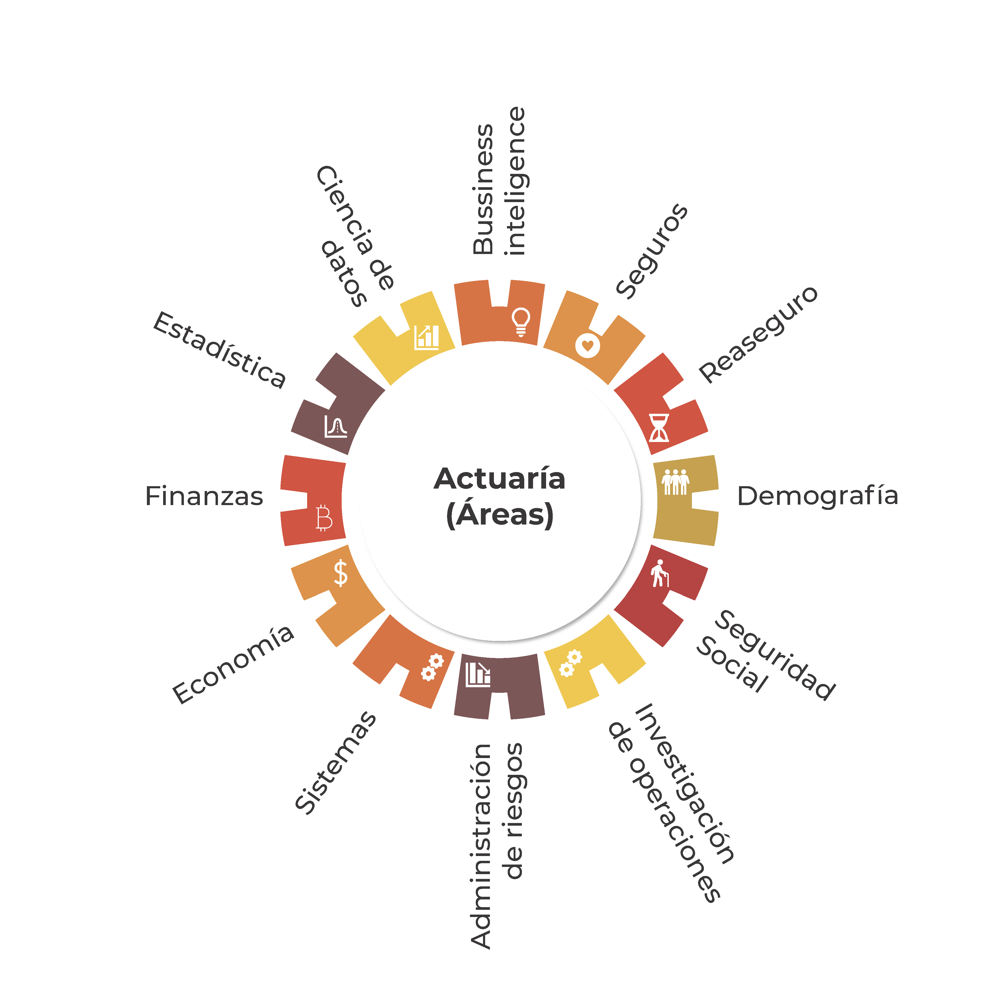
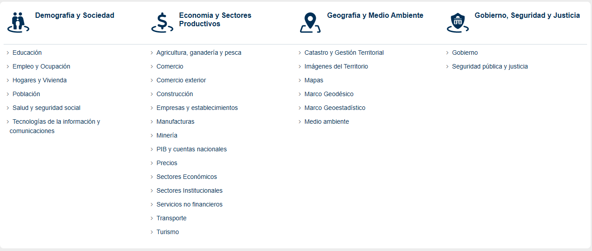
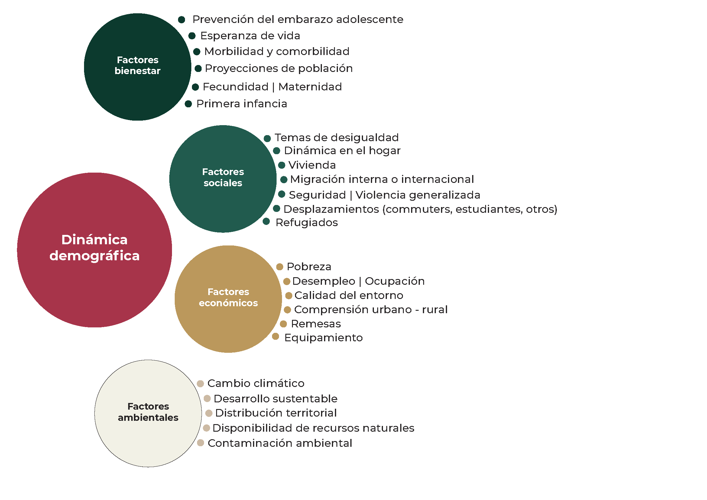
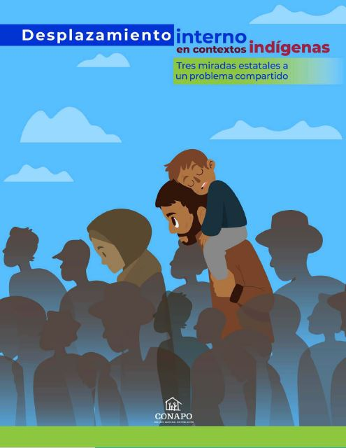

```{r setup, include=FALSE, echo = FALSE}
#options(htmltools.dir.version = FALSE)
knitr::opts_chunk$set(echo = FALSE,         # FALSE: los bloques de código NO se muestran
                      dpi = 300,            # asegura gráficos de alta resolución
                      warning = FALSE,      # los mensajes de advertencia NO se muestran
                      error = FALSE,
                      class.source = "small-text")  

library(xaringanthemer)
style_duo_accent(
  primary_color = "#D56A2E",
  secondary_color = "#FF961C",
  inverse_header_color = "#FFFFFF"
)


require(knitr)
require(tidyverse)
#require(icons)
require(fontawesome)
require(xaringanExtra)

#xaringanExtra::use_tile_view()
#xaringanExtra::use_panelset()
#xaringanExtra::style_share_again(
 # share_buttons = c("twitter", "linkedin", "pocket")
#

# Correr las presentaciones 
#xaringan::inf_mr()
#xaringan::infinite_moon_reader()
```


class: inverse, center, middle, titular, bg-black, title-down
background-image: url(img/fondo_conapo.png)
background-size: contain
background-position: -66% 10%

<!-- Presentación inicial  -->

# Consejo Nacional de Población  


---
class: middle, title-down


<!-- Areás de un actuario  -->

.pull-left[
# Áreas profesionales
]

.pull-right[.center[
      ]
]

---
class: center, title-down


---
class: center, title-down


<!-- CONAPO | INEGI  -->

## ¿¿A qué se dedicada cada uno?? 

.pull-left[.center[
      ]
]

.pull-right[.center[
        ]
]

---
class: center


<!-- INEGI (Temas) -->




---
class: center, 


<!-- Dinámica poblacional -->

## CONAPO

<!-- Imagen inicial -->


--
<!-- Imagen sobrepuesta -->


---
class: middle, center 


<!-- Dinámica demográfica -->



---

class: center 


<!-- Fuente de datos -->

# Fuente de datos 

.center[.left[
* ## <span style="color: black;"> Censos </span>
* ## <span style="color: black;"> Encuestas </span>
* ## <span style="color: black;"> Registros administrativos </span>  
* ## <span style="color: black;"> Reportes (Trabajo de campo) </span>
  ]
]

---
class: center 


<!-- Funciones que realizo -->

## Actividades que realizo 

.pull-left[.left[
* <span style="font-size: 25px;"> Investigación  </span>
* <span style="font-size: 25px;"> Data Analyst </span>
* <span style="font-size: 25px;"> Política Pública  </span>
* <span style="font-size: 25px;"> Estadística y matemáticas  </span> 
* <span style="font-size: 25px;"> Programación </span>
* <span style="font-size: 25px;"> Machine Learning </span>
* <span style="font-size: 25px;"> Evaluación de diseños muestrales </span>
* <span style="font-size: 25px;"> Big Data </span>
* <span style="font-size: 25px;"> Consultorías y Asesorías </span>
* <span style="font-size: 25px;"> Artículos y publicaciones </span>
  ]
]

.pull-right[]

---

class: center 


<!-- Trabajo para el actuario -->

## Actuarios (Estadística y Demografía) 

<!-- Imagen -->


---

class: center, middle
background-image: url(img/Anahuac_fondo.png)
background-size: contain
background-position: 0% 10%

<!-- Pregunta: ¿Cuándo no tenemos datos? -->

.left-column[]

.right-column[
  .center[
    <span class="large-text"> Desafios del actuario</span>
  ]
]
---
class: middle, title-down, logo-slide


<!-- Lenguajes de programación  -->

.pull-left[
# Lenguajes de programación 📦
]

.pull-right[
  .center[
  ]
]


---

class: center


<!-- Mapa Leaflet  -->

### Pueden crear mapas dinámicos 📦

<!--html_preserve-->
<iframe src = "https://dvillasanao.github.io/IME_Leaflet/IME_2020.html" position= "absolute"; top="0"; left="0"; bottom="0"; right="0"; width="100%"; height="70%"; border="none"; margin="0"; padding="0";  frameborder="0"; overflow="hidden"; display= "block";  min-height= "60vh";>"</iframe>
<!--/html_preserve-->

---
class: center, middle
background-image: url(img/Anahuac_fondo.png)
background-size: contain
background-position: 0% 10%

<!-- Pregunta: ¿Cuándo no tenemos datos? -->

.left-column[]

.right-column[
  .center[
    <span class="large-text">¿Cuándo no tenemos datos?</span>
  ]
]

---
class: center, middle
background-image: url(img/Anahuac_fondo.png)
background-size: contain
background-position: 0% 10%

<!-- Pregunta: ¿Cuándo no tenemos datos? -->

.left-column[]

.right-column[
  .center[
    <span class="large-text">¿Cuándo no tenemos datos?</span>
  ]
]

<!-- Imagen sobrepuesta -->
<iframe src="https://giphy.com/embed/WRQBXSCnEFJIuxktnw" 
        width="300" 
        height="300"  
        style="position: absolute; bottom: 10px; right: 100px;" 
        frameBorder="0">
</iframe>

---


<!-- Pregunta: ¿Cuándo no tenemos datos? -->

.left[<span class="large-text">Estadística clasica</span>]
.center[<span class="large-text">vs.</span>]
.right[<span class="large-text">Estadística bayesiana</span>] 



--

<span class="large-text"; style="top: 450px; left: 400px; color: black; font-size: 3.5em;">Estadística espacial</span>


---
class: center, middle
background-image: url(img/Anahuac_fondo.png)
background-size: contain
background-position: 0% 10%

<!-- Pregunta: La estadística miente -->

.left-column[]

.right-column[
  .center[
    <span class="large-text">La estadística miente</span>
  ]
]

--
.right-column[
  .bottom[.right[
    <span class="large-text"; style="bottom: 5px; left: 350px; color: black; font-size: 3em;">Y miente mucho</span>
  ]
]
]

---
class: center, subtitle-down


<!-- Caso de la CMPDH -->

## Comisión Mexicana de Defensa y Promoción de los Derechos Humanos  (CMDPDH)


-- 

<!-- Texto base -->
<span class="large-text" style="position: absolute; top: 250px; left: 50px; color: black; font-size: 1.5em; text-align: center;">
  Migración interna en México, 2020 <br> 
  3 936 679 personas <br> 
  (Periodo de 5 años)
</span>

<!-- Texto sobrepuesto que aparecerá al pasar el cursor -->
<span class="large-text" style="position: absolute; top: 30px; right: 40px; color: black; font-size: 1.5em; text-align: center; transition: opacity 0.5s;">
  Es decir, se mudan <br> 
  700 000 personas al año <br> 
  en promedio
</span>

--

---
class: center, middle
background-image: url(img/Anahuac_fondo.png)
background-size: contain
background-position: 0% 10%

.right-column[
  .center[
    <span class="large-text" style"display: block; text-align: center; margin: 10 auto;">
    Cuando tus datos están muy feos
    </span>
  ]
]

--
<!-- Imagen sobrepuesta -->
<iframe src="https://giphy.com/embed/4bBLOhnMb0vHG" 
        width="250" 
        height="250"  
        style="position: absolute; top: 5px; right: 100px;" 
        frameBorder="0">
        
</iframe> 

---
<!-- Pregunta: ¿Cuándo no tenemos datos? -->


```{r, echo=TRUE, eval=TRUE, message=FALSE, warning=FALSE}
require(ggplot2) 

ggplot(data = cars, aes(x = dist)) +
  geom_histogram(aes(y = ..density.., 
                     fill = ..count.., 
                     color = ..count..), 
                 bins = 30,
                 alpha = 0.7) +
  stat_function(fun = dnorm, 
                colour = "#0C3D7D9F", 
                linewidth = 2, 
                args = list(mean = mean(cars$dist, na.rm = TRUE), 
                            sd = sd(cars$dist, na.rm = TRUE))) +
  theme_bw() + 
  theme() + 
  scale_fill_viridis_c() +
  scale_color_viridis_c() +
  ggtitle("Histograma + curva normal teórica")
```

---
<!-- Pregunta: ¿Cuándo no tenemos datos? -->


```{r, echo = TRUE, eval=TRUE, message=FALSE, warning=FALSE}
set.seed(123)  # Para reproducibilidad
sesgada <- rgamma(10000, shape = 0.5, rate = 5)  # Distribución gamma sesgada

# Graficar la distribución
library(ggplot2)
library(viridis)


ggplot(data.frame(sesgada), aes(x = sesgada)) +
  geom_histogram(aes(y = ..density.., fill = ..count.., color = ..count..), bins = 100, alpha = 0.7) +
  theme_bw() + 
  scale_fill_viridis_c() +
  scale_color_viridis_c() +
  ggtitle("Distribucción gamma + curva gamma teórica")
```

---
class: center, middle
background-image: url(img/Anahuac_fondo.png)
background-size: contain
background-position: 0% 10%

.right-column[
  .center[
    <span class="large-text" style = "display: block; text-align: center; margin: 0 auto;"> Comparte tu conocimiento 🙏 
    </span>
  ]
]


---
